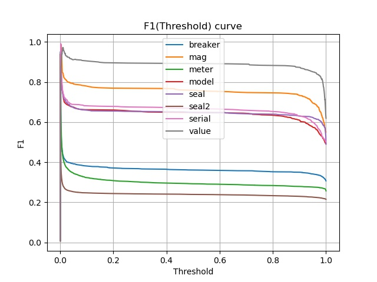
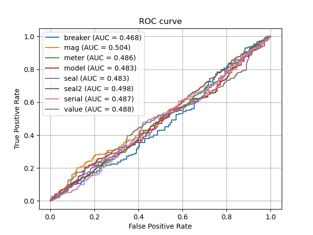
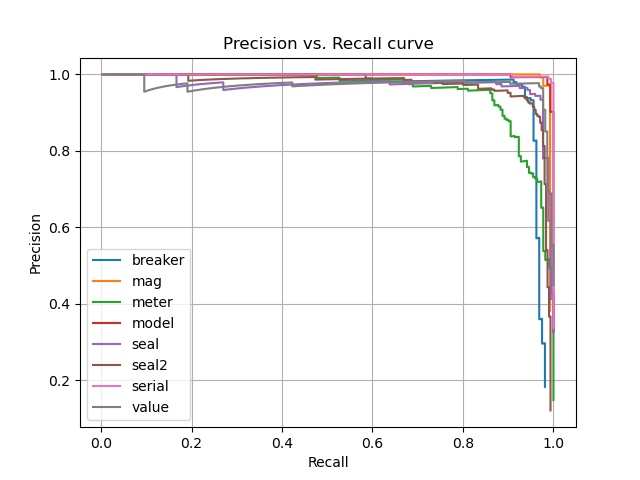

# Meters Object Detection
Вычислаются метрики F1-score, Recall, Precision, mAP, AP, AUC
По файлам с детекциями и аннотациями для каждого класса строятся кривые зависимости Precision(Recall), F1-score(Threadshold), ROC-curve.
Значения метрик могут выводиться в терминал, сохряняться в файл с расширением `.csv`.
Есть возможность сохранить рисунки в файл с расширением `.jpeg` в папку `/figures`. Название каждого рисунка состоит из префикса принадлежности к типу графика, даты в времени создания.

# Requirements and environment

### Linux/MacOS
Создайте директорию для проект. Перейдите в директорию проекта и создайте в ней виртуальное окружение для python (где `name_of_venv` - название вашего виртуального окружения):
```console
virtualenv name_of_venv
```
Запуск виртуального окружения:
```console
source name_of_venv/bin/activate
```
Установите требуемые пакеты:
```console
pip3 install -r requirements.txt
```
# Run service
Запуск расчета метрик:
```console
python3 main.py
```
# Result
Есть возможность отобразить рисунки на экране или сохранить их.
## Images
<tr>
  <td></td>
  <td></td>
  <td></td>
</tr>
