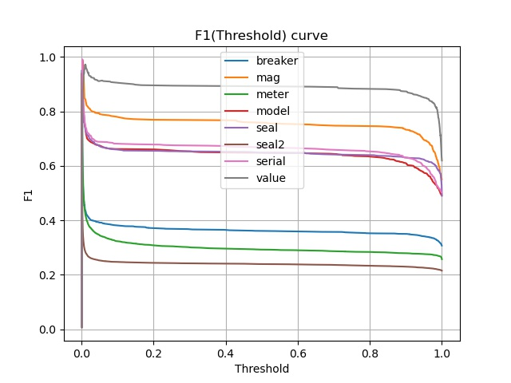
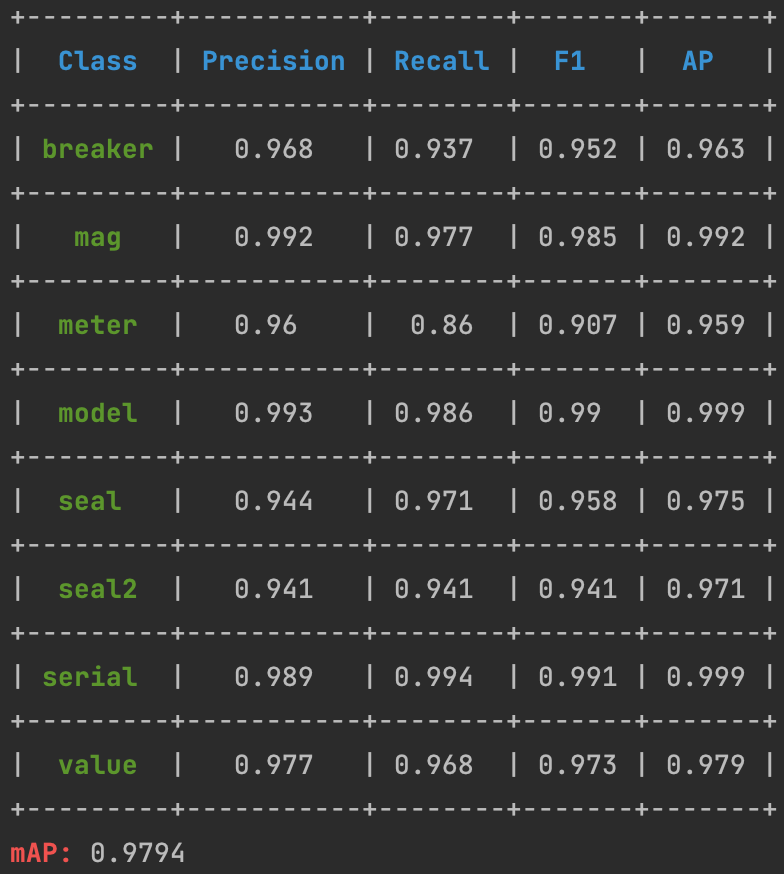

# Meters Object Detection
Вычислаются метрики F1-score, Recall, Precision, mAP, AP, AUC.
По файлам с детекциями и аннотациями для каждого класса строятся кривые зависимости Precision(Recall), F1-score(Threadshold), ROC-curve.
Значения метрик могут выводиться в терминал, сохряняться в файл с расширением `.csv` в папку `results`. Название файла с метриками состоит из префикса, даты и времени создания.
Есть возможность сохранить рисунки в файл с расширением `.jpg` в папку `results/figures`. Название каждого рисунка состоит из префикса принадлежности к типу графика, даты и времени создания.

# Requirements and environment

### Linux/MacOS
Создайте директорию для проект. Перейдите в директорию проекта и создайте в ней виртуальное окружение для python (где `name_of_venv` - название вашего виртуального окружения):
```console
virtualenv name_of_venv
```
Запуск виртуального окружения:
```console
source name_of_venv/bin/activate
```
Установите требуемые пакеты:
```console
pip3 install -r requirements.txt
```
# Run service
Запуск программы осуществляется с помощью файла `run.sh`:
```console
source run.sh
```
Скрипт можно модифицировать. Пример текущего скрипта `run.sh`:
```console
python3 main.py --test_files /path_to_file_with_names_of_test_images/test.txt \
--cls_names /path_to_file_with_names_of_classes/classes.json \
--yolo_det /path_to_files_with_yolo_detections/ \
--xml_ann /path_to_files_with_yolo_annotations/ \
--show_fig \
--save_fig \
--show_term \
--save_metric
```
Флаги (ОБЯЗАТЕЛЬНЫЕ):
* `--test_files` - абсолютный путь до файла с названиями всех тестовых изображений
* `--cls_names` - абсолютный путь до файла с названиями всех классов (в формате  или `.names`)
* `--yolo_det` - абсолютный путь до всех файлов с детекциями в формате `.txt` (количество файлов
  по данному пути совпадает с числом исследуемых классов)
* `--yolo_det` - абсолютный путь до всех файлов с детекциями в формате `.txt` (количество файлов
  по данному пути совпадает с числом исследуемых классов)
* `--ed_det` - абсолютный путь до всех файлов с детекциями в формате `.txt` (количество файлов
  по данному пути совпадает с числом исследуемых тестовых изображений)
* `--xml_ann` - абсолютный путь до всех файлов с аннотациями в формате `.xml`
* `--json_ann` - абсолютный путь до всех файлов с аннотациями в формате `.json` (количество файлов
  по данному пути совпадает с числом исследуемых тестовых изображений)
  
Флаги (НЕОБЯЗАТЕЛЬНЫЕ):
* `--show_fig` - показать все изображения
* `--save_fig` - сохранить все изображения
* `--show_term` - показать расчитанные метрики в терминале
* `--save_metric` - сохранить все метрики в файл
# Result
Есть возможность отобразить рисунки на экране или сохранить их. Расчем метрик выводится в терминал или сохраняется в файл `.csv` в папку `results`.
<table width="1000" margin=auto>
  <td></td>
  <td></td>
  <td></td>
</table>

